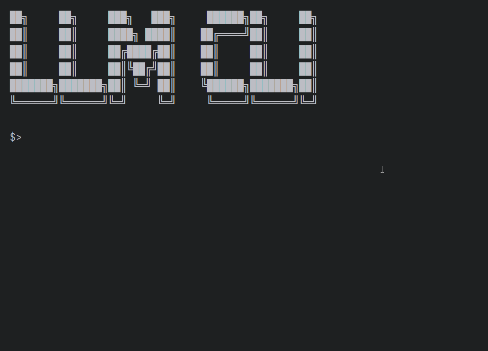

# Exercise 1 : Zero-shot prompting

This first exercise aims to introduce LLM interaction with Spring AI by implementing a simple prompt use case.

## Hands-on

Modify the `LLMService` class.

### Part 1 - Add the ChatClient object

We will use a `ChatClient` object to interact with the LLM. This object can be built with `ChatClient.Builder` already instantiated thanks to autoconfiguration.

Create a private final attribute `ChatClient` named chatClient.
Create a private final attribute `SystemMessage` named systemMessage.

In the LLMService constructor, set chatClient with the result of calling `build()` on the builder.

```java
private final ChatClient chatClient;
private final SystemMessage systemMessage;

public LLMService(ChatClient.Builder builder, @Value("classpath:/prompt-system.md") Resource promptSystem) {
    this.systemMessage = new SystemMessage(promptSystem);
    this.chatClient = builder.build();
}
```

### Part 2 - Complete System Prompt

Update the `prompt-system.md` file in `src/main/resources` folder with the following content:

```markdown
Please answer the question asked and provide the shortest possible response without extra text nor line-breaks, using formal English language.
```

### Part 3 - Create query options object

Create a `OllamaOptions` attribute and initialize it in the constructor by using `OllamaOptions.create()` method and set model to `mistral:7b` and temperature to `0.8`.

### Part 4 - Implement the model query in streaming mode

Complete the existing `getResponse` method with the following steps:

1. create a new `Prompt` object using `Prompt(List<Message> messages, OllamaOptions options)` constructor. Pass the previously created objects as arguments, where SystemMessage and UserMessage are included in a list, along with the OllamaOptions object.
2. call `chatClient.stream` method by passing the `Prompt` object as argument
3. map and return `chatClient.stream` result

```java
private Stream<String> getResponse(final Message userMessage) {

    List<Message> messages = new ArrayList<>();
    messages.add(systemMessage);
    messages.add(userMessage);
    
    Prompt prompt = new Prompt(messages, options);
    return chatClient.prompt(prompt).stream()
            .chatResponse().toStream()
            .map(ChatResponse::getResults)
            .flatMap(List::stream)
            .map(Generation::getOutput)
            .map(AssistantMessage::getContent);
}
```

## Solution

If needed, the solution can be checked in the `solution/exercise-1` folder.

## Time to test your first prompt !

1. Make sure that ollama container is running
2. Run the application
3. In the application prompt, type this command to ask the model `llm List the names of the top 5 places to visit in Canada`
4. Check the response
5. Try a new question `llm What is the best to visit in July ?`
6. What do you think about the response ?



## Conclusion

In this first exercise, we implemented a simple prompt use case, and we understood some concepts.

### About LLM

- LLM handle different types of messages called "roles" (System, User, Assistant)
- System role set the model overall behavior
- User role provides the user input
- LLM does not automatically keep conversation history

### About Spring AI

- Spring AI provides some classes and APIs to interact with LLM
- Spring AI provides options that can be changed for each query to the LLM
- Conversational memory is not handled by default

### Next exercise

Now we can move to the next exercise to provide some memory to the LLM.

[Exercise 2: Conversational memory](exercise-2.md)