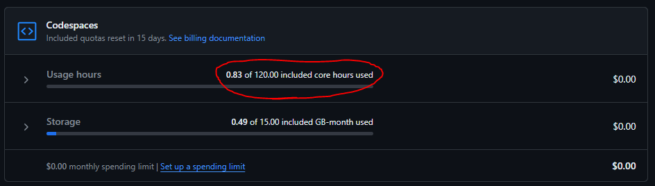
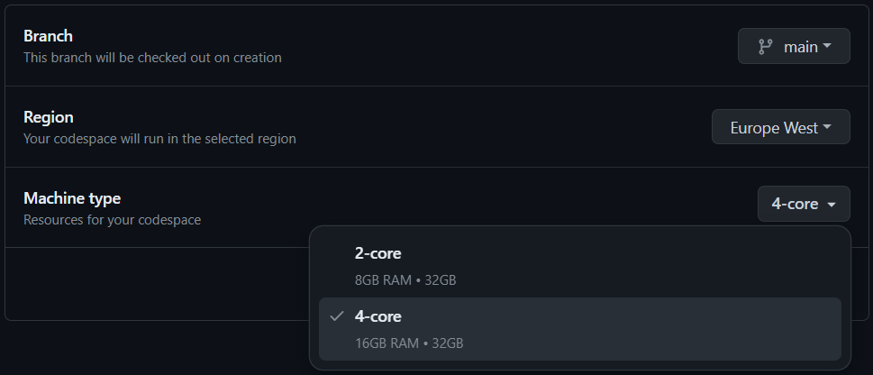
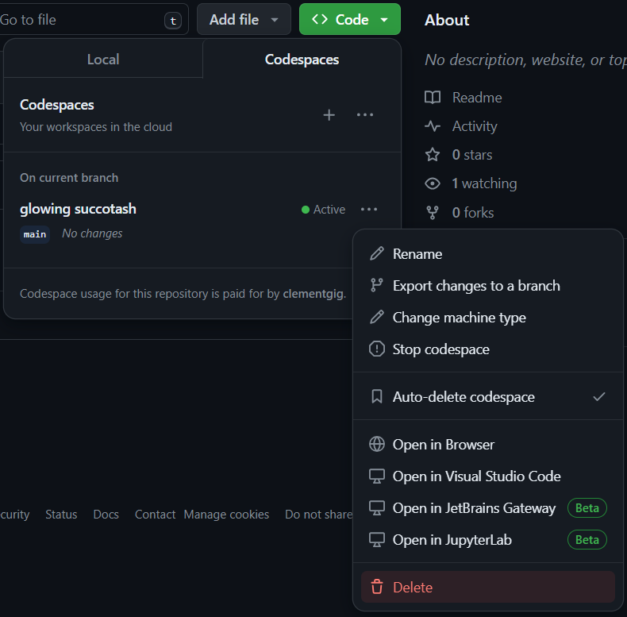

# Setup for GitHub Codespaces environment

Here are the instructions to run the workshop in GitHub Codespaces.

## Requirements

- Internet access
- Proxy policies must authorize access to https://github.com/
- Active GitHub account
- At least 20 core hours on your GitHub Codespaces quota (https://github.com/settings/billing/summary)

## Create the Codespace

1. Go to https://codespaces.new/AxaFrance/spring-ai-workshop

2. Select the following options:
   - Branch: main
   - Region: Europe West
   - Machine type: 4-core 

3. The Codespace environment will be opened

[Go back](../../README.md)

## After the workshop

Delete the Codespace to avoid consuming core hours unnecessarily.

